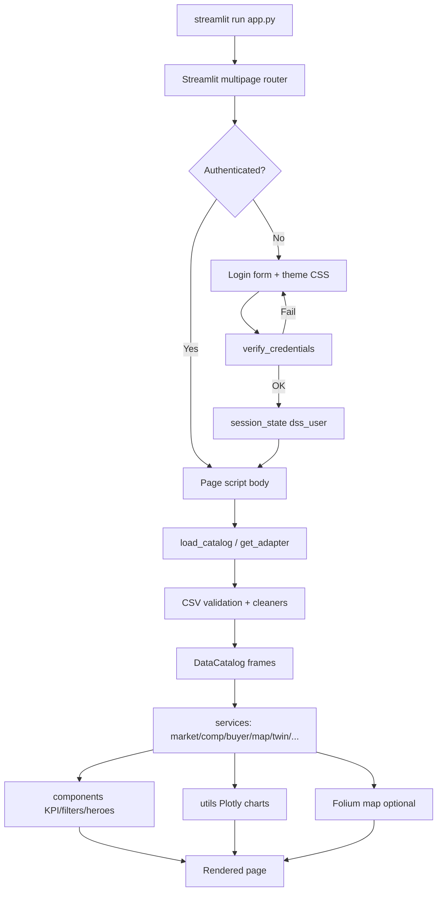

# PROJECT_AUDIT.md — AURA-Market Repository Architecture Review

**Audit type:** Read-only inspection (no application code changes)  
**Product name:** AURA-Market  
**Repository path:** `C:\Users\Admin\Projects\bagaluru-analytics-dss`  
**Entry command:** `python -m streamlit run app.py`  
**Audit date:** 2026-07-20  

---

# 1. Project Overview

## What is this application?

**AURA-Market** is a **Streamlit multipage Decision Support System (DSS)** for urban real estate analytics, focused on the **Bagaluru / Aerospace Highway (KIADB)** micro-market in North Bengaluru.

It is intentionally positioned as more than a dashboard: it combines:

- **Diagnostic analytics** (DMAIC / Six Sigma framing on unsold inventory)
- **Predictive signals** (GB absorption forecast, zone suitability RF, short-horizon forecasting)
- **Prescriptive simulation** (Digital Twin with price/subvention interventions and competitive cannibalization)
- **Competition intelligence** (RERA, upcoming, under-construction, land, margin viability)
- **Geospatial DSS** (25-zone Folium + Plotly Mapbox suitability platform)

Branding/config title:

> *AURA-Market: AI-Powered Predictive & Prescriptive Decision Support System for Urban Real Estate Analytics*

## What business problem does it currently solve?

**Primary problem (competition blind spot):**  
Developers plan launch of project X at price Y without visibility into approved, advertised, and under-construction competing supply, land cost/margins, and buyer demand structure — causing slow absorption and cannibalized pipelines.

**Secondary problems addressed in-app:**

- Measuring unsold inventory as a “defect” (Six Sigma DPMO / sigma)
- Understanding who buys (channels, age, native vs outstation, unit mix)
- Linking SMC marketing spend to outcomes
- Simulating rival launches and intervention recovery
- Scoring *where* to build across Bengaluru zones

## What modules/pages currently exist?

| Streamlit surface | File | Role |
|---|---|---|
| Home | `app.py` | Auth gate, product framing, dataset readiness, module map |
| Market Overview | `pages/1_Market_Overview.py` | Phase-1 DEFINE/MEASURE scorecard |
| Competition Intelligence | `pages/2_Competition_Intelligence.py` | RERA / upcoming / UC / land / margin |
| Audience Demographics | `pages/3_Buyer_Analytics.py` | Buyer + lead funnel demographics |
| Marketing Intelligence | `pages/4_Marketing_Intelligence.py` | SMC spend efficiency |
| DMAIC Workspace | `pages/5_DMAIC_Workspace.py` | Problem/CTQs/Pareto/at-risk |
| Builder Deep Dive | `pages/6_Builder_Deep_Dive.py` | Per-builder KPIs + GB forecast |
| Digital Twin | `pages/7_Digital_Twin.py` | Cannibalization + intervention simulator |
| AI Recommendations | `pages/8_AI_Recommendations.py` | Rule engine + mini twin |
| SPC Control Chart | `pages/9_SPC_Control_Chart.py` | I-MR CONTROL + forecast |
| Map Decision Support | `pages/10_Map_Decision_Support.py` | Phase-2 geospatial DSS (tabs) |
| Executive Reports | `pages/11_Executive_Reports.py` | Markdown decision brief download |
| Forecasting | `pages/12_Forecasting.py` | Short-horizon sales velocity outlook |

## What is the overall architecture?

Layered Streamlit architecture:

```
UI (pages + components)
        ↓
Services (business logic)
        ↓
Adapters / DataCatalog (validated DataFrames)
        ↓
CSV data files (+ scripts that build them)
```

Cross-cutting:

- `config/` — settings, schemas, demo auth
- `models/` — dataclasses (`FilterState`, `MarketKPIs`, etc.)
- `utils/` — Plotly chart builders
- `assets/` — CSS theme
- `tests/` — service-level pytest
- `src/` — **legacy duplicate** of early helpers (superseded by `services/`)

---

# 2. Folder Structure

## Root

| Path | Responsibility |
|---|---|
| `app.py` | Streamlit home entry; login; readiness; module cards |
| `README.md` | Run instructions / positioning |
| `SCOPE.md` | Early mentor/requirement mapping notes |
| `requirements.txt` | Runtime dependencies |
| `requirements-dev.txt` | Dev tooling (`pytest`) |
| `.gitignore` | Ignores caches/venvs/xlsx temps |

## `pages/`

Streamlit multipage scripts (auto-discovered). Each page inserts project root into `sys.path`, calls `require_login()`, then services/utils.

## `components/`

| File | Responsibility |
|---|---|
| `layout.py` | Theme injection, login gate, sidebar brand/user, heroes, section labels, module cards |
| `filters.py` | Global Builder/Project/Date/Quarter filter bar → `FilterState` |
| `kpi_cards.py` | HTML KPI grid renderer + buyer distribution progress bars |
| `__init__.py` | Package marker |

## `services/`

| File | Responsibility |
|---|---|
| `data_loader.py` | Load/validate/clean CSVs into cached `DataCatalog` |
| `data_validator.py` | Required-column validation |
| `adapters.py` | `LocalCatalogAdapter` / stub `LiveApiAdapter` |
| `filter_service.py` | Apply `FilterState` to frames |
| `market_service.py` | Market KPIs + chart frames |
| `sigma_service.py` | DPMO, sigma mapping, augmentation, market KPIs |
| `competition_service.py` | Competition snapshot + launch threat helper |
| `margin_service.py` | Developer Margin Viability Index |
| `buyer_service.py` | Audience demographics enrichment + aggregates |
| `marketing_service.py` | SMC spend rollups + efficiency |
| `dmaic_service.py` | DMAIC DEFINE/MEASURE snapshot |
| `recommendation_engine.py` | Defect probability, root causes, recs, GB forecast |
| `twin_service.py` | Segmented twin + cannibalization paths |
| `spc_service.py` | I-MR chart math + linear/seasonal forecast |
| `map_service.py` | Zone suitability RF, metro stations, what-if |
| `report_service.py` | Executive markdown brief |
| `__init__.py` | Package marker |

## `models/`

| File | Responsibility |
|---|---|
| `market.py` | `FilterState`, `DatasetStatus`, `ValidationReport`, `MarketKPIs`, `MarketBundle` |
| `README.md` | Notes reserved model wrappers |
| `__init__.py` | Package marker |

## `utils/`

| File | Responsibility |
|---|---|
| `charts.py` | Shared Plotly brand styling + market charts |
| `dmaic_charts.py` | Absorption bands, donut, bubble, twin, I-MR visuals |
| `map_charts.py` | Radar, heatmap mapbox, importance, correlation |
| `formatting.py` | KPI value formatters |
| `__init__.py` | Package marker |

## `config/`

| File | Responsibility |
|---|---|
| `settings.py` | Paths, titles, thresholds, dataset filenames, native-city tokens |
| `schemas.py` | Required columns per dataset |
| `auth.py` | Demo users + session key names |
| `__init__.py` | Package marker |

## `data/`

Clean CSVs consumed by loader (see §5).

## `assets/`

| File | Responsibility |
|---|---|
| `styles.css` | Corporate light CSS theme |
| `.gitkeep` | Keeps folder in VCS |

## `scripts/`

| File | Responsibility |
|---|---|
| `build_seed_data.py` | Generates inventory/competition/zone seeds + ingests Excels |
| `build_marketing_spends.py` | Normalizes SMC workbook → long `marketing_spends.csv` |
| `ingest_lead_insights.py` | Lead PDF note + curated `lead_insights.csv` |
| `validate_submission.py` | Submission readiness checker |

## `docs/`

Architecture, AURA spec mapping, demo script, limitations, checklist, market overview notes.

## `tests/`

| File | Responsibility |
|---|---|
| `test_market_foundation.py` | Catalog/filter/KPI foundation tests |
| `test_submission_pack.py` | Branding, margin, cannibalization, demographics, map tests |

## `src/` (**legacy**)

Earlier prototypes (`loaders.py`, `sigma_utils.py`, `recommendations.py`, `digital_twin.py`, `spc.py`, `suitability.py`). **Not the primary runtime path** for current pages (pages import `services/`).

---

# 3. Application Flow

## Starting from `streamlit run`

1. User runs `python -m streamlit run app.py`.
2. Streamlit starts server; loads `app.py` as home and scans `pages/` for multipage navigation.
3. On each page script execution:
   - `sys.path` gets project root.
   - `st.set_page_config(...)` runs.
   - `require_login()` (`components/layout.py`):
     - Injects `assets/styles.css`.
     - Checks `st.session_state` keys `dss_authenticated` / `dss_user`.
     - If unauthenticated: renders login form; validates against `config/auth.py` demo users; `st.stop()`.
     - If authenticated: renders sidebar brand/user + sign-out.
4. Page loads data via:
   - `load_catalog()` (`lru_cache`) and/or
   - `get_adapter()` → `LocalCatalogAdapter` wrapping the catalog.
5. Optional filters → `FilterState` → `apply_filters` / service builders.
6. Services compute metrics/frames.
7. Components (`render_kpi_cards`, heroes) + utils charts (`st.plotly_chart`) render UI.
8. Map page additionally builds Folium map → `st_folium`.

## Flow diagram



## Session state

| Key | Purpose |
|---|---|
| `dss_authenticated` | Bool gate |
| `dss_user` | `{username, name, role}` |
| Streamlit widget keys | e.g. `market_builder`, `ai_zone`, rival twin widgets |

## Data loading

Centralized in `services/data_loader.load_catalog()`:

- Reads files from `config.settings.DATASETS`
- Validates required columns (`config/schemas.py`)
- Applies dataset-specific cleaners
- Returns cached `DataCatalog` + `ValidationReport`

## Components / Charts / ML / Maps

- **Components:** layout, filters, KPIs  
- **Charts:** Plotly via `utils/*`  
- **ML:** scikit-learn GB (absorption) + RF (suitability) in services  
- **Maps:** Folium (`streamlit-folium`) + Plotly `scatter_mapbox`

---

# 4. Streamlit Architecture

## Multipage structure

Native Streamlit pages folder. Home = `app.py`. Numbered filenames control sidebar order (`1_...` … `12_...`).

## Sidebar

- Auth chrome + brand (logged-in)
- Global filters on selected pages (`render_global_filters`)
- Page-specific controls (developer select, rival launch, forecast scope, map flood/score filters)

## Navigation

Sidebar page list generated by Streamlit from `pages/`. Home module cards are informational only (not programmatic routers).

## Shared components

`require_login`, `page_hero`, `section_label`, `render_kpi_cards`, `render_global_filters`, `module_cards`, `info_panel`.

## Reusable utilities

`utils/charts.py`, `utils/dmaic_charts.py`, `utils/map_charts.py`, `utils/formatting.py`.

## Caching

| Mechanism | Where | Effect |
|---|---|---|
| `@lru_cache(maxsize=1)` | `load_catalog` | Process-level single catalog |
| `@lru_cache(maxsize=1)` | `scored_zones` | Cached zone scoring DF |
| No `@st.cache_data` | — | Streamlit-native caching not used |
| `clear_catalog_cache()` | Tests/scripts | Busts loader cache |

**Implication:** CSV changes require process restart (or explicit cache clear) to appear.

---

# 5. Data Layer

## Datasets currently used

### 1) `data/projects.csv` (~19 rows)

- **Columns:** developer, project, tower, total_units, units_sold, price_psf, avg_unit_size_sqft, construction_delay_months, construction_progress_pct, brand_score, lat, lon, status, units_unsold, absorption_pct, segment, micro_market  
- **Purpose:** Inventory master for Bagaluru projects  
- **Loaded:** `data_loader` → cleaner adds/normalizes absorption & `sales_value_cr`  
- **Used by:** Market, Builder, Twin, Recommendations, Competition margins, DMAIC, Reports, Map indirectly via inventory, Forecasting selectors  
- **Preprocessing:** numeric coerce, unsold fill, absorption recalc, sales value compute  

### 2) `data/monthly_absorption.csv` (~684 rows)

- **Columns:** month, developer, project, units_sold_month, cumulative_sold, total_units, absorption_pct  
- **Purpose:** 35-month sales velocity series  
- **Loaded:** parses `YYYY-MM` → timestamp; adds `fy_quarter`  
- **Used by:** Market (sales value period), SPC, Forecasting, filter date scopes, DMAIC KPIs via monthly  

### 3) `data/buyer_demographics.csv` (~2580 rows)

- **Columns:** source_project, Stage, Created Date, Primary Source, Apartment Sub Type, Apartment, Postal Code, City, First Time Buyer, 1st Applicant Age/Gender, Industry, Occupation, incomes…  
- **Purpose:** Real booking personas (Atmosphere / Blubelle / Ecopolitan ingest)  
- **Loaded:** booking-stage filter, date parse, developer map, fy_quarter  
- **Used by:** Buyer/Audience page, Market booking trend/mix, Marketing efficiency joins, Reports  
- **Note:** Marital Status not present in current CSV columns list → family proxy relies mainly on 2nd-applicant signals when present  

### 4) `data/marketing_spends.csv` (~1028 rows)

- **Columns:** project, fy_label, quarter, period_start, spend_cr  
- **Purpose:** Absolute SMC spend in ₹ Cr (long format)  
- **Loaded:** period parse, fy_quarter normalize  
- **Used by:** Marketing Intelligence, Market KPIs (marketing spend), Reports  

### 5) `data/smc_spends.csv` (~10 rows)

- **Columns:** project + many FY-Qn share columns  
- **Purpose:** Original wide share-of-spend sheet  
- **Loaded:** registered as `marketing_spend_share` (optional schema not strictly required beyond presence)  
- **Used by:** **Loaded into catalog but no current page primarily analyzes it**; operational spend UI uses `marketing_spends.csv`  
- **Status:** **Underused / effectively unused in UI** relative to long-format spends  

### 6) `data/zones.csv` (~25 rows)

- **Columns:** zone, lat, lon, avg_price_psf, price_trend_yoy_pct, metro_km, highway_km, hospitals, schools, malls, parks, flood_risk, air_quality_index, population_growth_index  
- **Purpose:** Bengaluru micro-market amenity/price features for Map DSS  
- **Loaded:** as-is (+ RF scoring in `map_service`)  
- **Used by:** Map Decision Support  

### 7) `data/rera_projects.csv` (~12 rows)

- **Columns:** rera_id, project, developer, approval_date, micro_market, units, status  
- **Purpose:** RERA crowding signal (seed)  
- **Used by:** Competition Intelligence, Reports  

### 8) `data/upcoming_projects.csv` (~5 rows)

- **Columns:** project, developer, stage, expected_launch, planned_units, indicative_price_psf, signal  
- **Purpose:** Pre-launch / coming soon competition  
- **Used by:** Competition, Twin rival defaults, Reports  

### 9) `data/under_construction.csv` (~11 rows)

- **Columns:** project, developer, total_units, unsold_units, construction_pct, expected_completion, note  
- **Purpose:** Active supply / unsold UC stock  
- **Used by:** Competition, Reports  

### 10) `data/land_prices.csv` (~8 rows)

- **Columns:** micro_market, land_price_psf, land_price_cr_per_acre, yoy_change_pct, commentary  
- **Purpose:** Land cost indices  
- **Used by:** Competition land tab, Margin Viability Index  

### 11) `data/lead_insights.csv` (~7 rows)

- **Columns:** channel_cluster, funnel_role, indicative_share_pct, decision_note  
- **Purpose:** Curated lead funnel (PDF was image-only)  
- **Used by:** Buyer/Audience page  
- **Notes file:** `data/lead_insights_README.txt`  

## Uploaded / external sources (not in `data/` as raw)

Original Downloads Excels/PDF were transformed by scripts into CSVs. Raw Excel/PDF are **not** runtime dependencies once CSVs exist.

---

# 6. Business Features

| Feature | Purpose | Implemented % | Files involved |
|---|---:|---:|---|
| Market Overview | Micro-market sigma/absorption scorecard | **90%** | `pages/1_*`, `market_service`, `sigma_service`, `dmaic_charts` |
| Builder Analytics / Deep Dive | Per-developer KPIs + ML forecast + root causes | **90%** | `pages/6_*`, `recommendation_engine`, `sigma_service` |
| DMAIC Workspace | Problem/CTQs/Pareto/at-risk MEASURE shell | **70%** | `pages/5_*`, `dmaic_service` (ANALYZE Fishbone/SHAP incomplete) |
| SPC | I-MR CONTROL + OOC/runs + forecast | **90%** | `pages/9_*`, `spc_service`, `dmaic_charts` |
| Digital Twin / Developer Simulator | Segmented sales simulation + interventions | **85%** | `pages/7_*`, `twin_service` (NumPy engine, not SimPy package runtime) |
| Competitive Cannibalization | Rival launch demand diversion | **85%** | `twin_service`, `pages/7_*` |
| AI Recommendation | Rule/benchmark recommendations + mini twin | **80%** | `pages/8_*`, `recommendation_engine` |
| Map DSS | Where-to-build suitability geospatial DSS | **85%** | `pages/10_*`, `map_service`, `map_charts` |
| Competition Intelligence | Blind-spot supply visibility | **90%** | `pages/2_*`, `competition_service` |
| RERA Pipeline | Approval density | **75%** (seed, not live KRERA) | `rera_projects.csv`, competition page |
| Upcoming Projects | Coming-soon pipeline | **80%** (seed) | `upcoming_projects.csv` |
| Land Prices + Margin Index | Land arbitrage + viability | **85%** | `margin_service`, competition tab |
| Buyer / Audience Demographics | Channel/age/origin/family | **85%** | `buyer_service`, page 3 |
| Marketing Intelligence | SMC efficiency | **80%** | `marketing_service`, page 4 |
| Forecasting | Short-horizon predictive | **75%** | `pages/12_*`, `spc_service.forecast_linear_seasonal` |
| Executive Reports | Downloadable decision brief | **80%** | `pages/11_*`, `report_service` |
| Auth | Demo login gate | **60%** (demo only) | `config/auth.py`, `layout.py` |
| Live data adapters | Swap to live feeds | **20%** stub | `adapters.LiveApiAdapter` |

---

# 7. Machine Learning

## Model A — Gradient Boosting Absorption Forecast

| Item | Detail |
|---|---|
| Algorithm | `sklearn.ensemble.GradientBoostingRegressor` |
| Location | `services/recommendation_engine.fit_gb_forecast` |
| Inputs | price_psf, avg_unit_size_sqft, construction_delay_months, construction_progress_pct, brand_score, total_units |
| Target | absorption_pct |
| Training | 10× Gaussian augmentation (`sigma_service.augment_for_ml`) then train/test split; fit on train |
| Prediction | Predict on original projects; return actual vs `ml_forecast_pct` + holdout R² |
| Status | **Implemented and used** on Builder Deep Dive |
| Notes | Trains at request-time (not persisted). Small-n mitigated by augmentation |

## Model B — Random Forest Zone Suitability

| Item | Detail |
|---|---|
| Algorithm | `RandomForestRegressor` (n_estimators=160) |
| Location | `services/map_service.scored_zones` / `feature_importance` |
| Inputs | engineered features from zones (metro/highway inverses, amenities, flood map, AQI inv, pop growth, price/trend) |
| Labels | **Pseudo-labels** from the same engineered weighted formula (not external ground truth) |
| Output | suitability_score 0–100 + label |
| What-if | Deterministic weighted formula `what_if_score` (mirrors feature logic; not always the fitted RF path) |
| Status | **Implemented** for Map DSS; scientifically “illustrative DSS” (self-supervised/pseudo-label) |

## Non-ML predictive / scoring (often mistaken for ML)

| Technique | Status |
|---|---|
| Heuristic `defect_probability` | Rule-weighted score (not trained) |
| Rule recommendation engine | Threshold rules vs sold-out benchmarks |
| SPC forecast (`polyfit` + seasonal sine) | Classical stats, not ML |
| Twin Poisson simulation | Generative simulation, not ML |

## Placeholders

- `LiveApiAdapter` methods raise `NotImplementedError`
- No persisted model artifacts (`.pkl`/`.joblib`) in repo
- No SHAP implementation despite earlier ANALYZE vision

---

# 8. Maps

| Capability | Implementation |
|---|---|
| Libraries | `folium`, `streamlit-folium`, Plotly `scatter_mapbox` |
| Primary interactive map | Folium `Map` tiles=`CartoDB positron`, Bengaluru center |
| Zone markers | `CircleMarker` color by suitability (≥75 green, ≥50 yellow, else red) |
| Popups | Score, price, road, flood, metro distance |
| Metro overlay | 13 hardcoded stations in `map_service.METRO_STATIONS` |
| Filters | Flood risk multiselect + min AI score slider (sidebar on map tab) |
| Heat/bubble map | Plotly scatter_mapbox: size=population growth, color=score |
| GIS depth | **No** shapefiles/parcels/topology; point-based only |
| Dark Carto tiles | Spec mentioned dark theme; current Folium uses **positron** (light) |

---

# 9. Charts

| Visualization | Type | Source | Business meaning |
|---|---|---|---|
| Absorption band bars | Plotly bar | projects | Traffic-light absorption health |
| Sold/unsold donut | Pie hole | projects totals | Inventory mix |
| Price vs absorption bubble | Scatter | projects | Price positioning vs sell-through |
| Booking trend area | Area | bookings by month | Demand velocity |
| Buyer mix pie | Pie | unit subtypes | Product mix demand |
| Stacked sold/unsold | Stacked bar | builder projects | Deep-dive inventory |
| ML vs actual grouped bars | Grouped bar | GB predictions | Model vs reality |
| Twin multi-curve | Line | twin paths | Baseline / rival / intervention |
| I-Chart / MR Chart | Line + limits | monthly sales | Six Sigma CONTROL |
| SPC/Forecast bands | Line + dots | history+forecast | Near-term outlook |
| RERA approvals by year | Bar | rera | Crowding over time |
| Upcoming scatter | Scatter | upcoming | Competitive launch scale/price |
| UC unsold bars | Bar | under_construction | Competing stock |
| Land price bars | Bar | land | Cost heat by market |
| Margin bars | Horizontal bar | margin table | Viability ranking |
| Buyer channel/unit/age/origin/family | Pie/Bar | bookings | Audience structure |
| SMC spend line/bars | Line/Bar | marketing | Spend intensity |
| Marketing efficiency scatter | Scatter | efficiency frame | Outcome per ₹ Cr |
| DMAIC Pareto | Bar | unsold share | Concentration of defect stock |
| Map radar / dual radar | Polar | zone features | Amenity profile |
| Price/trend/corr | Bar/Scatter/Heatmap | zones | Location price analytics |
| RF importance | Horizontal bar | RF importances | Suitability drivers |
| Mapbox bubble | Scatter map | zones | Spatial suitability landscape |

---

# 10. Business Logic

| Rule / Metric | Logic (as implemented) |
|---|---|
| Absorption % | `units_sold / total_units * 100` |
| At-risk project | Absorption `< ABSORPTION_AT_RISK_PCT` (70) |
| Healthy/sold-out benchmark | Absorption `≥ ABSORPTION_HEALTHY_PCT` (95) |
| DPMO | `(unsold / launched) * 1,000,000` |
| Sigma Level | Log-interpolate DPMO against discrete Six Sigma table |
| High price signal | `price_psf > 9500` |
| Construction delay signal | `> 6` months |
| Large unit signal | `avg_unit_size_sqft > 2000` |
| Early stage signal | `construction_progress_pct < 50` |
| Weak brand signal | `brand_score < 7` |
| Defect probability | Additive heuristic capped at 0.95 |
| Recommendations | Rule actions with estimated recoverable units + sold-out benchmarks |
| Margin viability | `(sale − land*FSI_load − construction_cost) / sale`; Viable≥22%, Stressed≥12%, else Unviable |
| Launch threat | Upcoming price within ~5%/15% of planned launch → High/Medium/Lower |
| Suitability score | RF on pseudo-labels / what-if weighted formula |
| Twin cannibalization | If rival cheaper after launch month, divert budget/normal demand fractions (gap-amplified) |
| Native audience | City token match against Karnataka/Bengaluru token list |
| Age bands | Parsed from `1st Applicant Age` into buckets |
| FY quarter | Indian FY starting April |
| SPC sigma | `MR̄ / d2` with `d2=1.128`; UCL/LCL ±3σ; MR UCL=`D4*MR̄` |
| Runs rules | 8 same-side of CL; 6-point monotonic trend |
| Forecast | Linear trend + light seasonal sine + residual σ bands |

---

# 11. Configuration

## Dependencies

**`requirements.txt`:** streamlit, pandas, numpy, plotly, folium, streamlit-folium, scikit-learn, openpyxl  

**`requirements-dev.txt`:** pytest  

**Not declared but historically discussed:** `simpy` (engine is NumPy, not SimPy runtime)

## Environment

- No `.env` / secrets manager
- Demo passwords in `config/auth.py` (plaintext)
- `DATA_ADAPTER_MODE = "local"` hardcoded in settings

## Config files / constants / paths

- Paths: `PROJECT_ROOT`, `DATA_DIR`, `ASSETS_DIR`
- Dataset filename map in `settings.DATASETS`
- Schema contracts in `schemas.REQUIRED_COLUMNS`
- Thresholds: absorption, price, delay, margin, cannibal diversion, native tokens

---

# 12. Code Quality Review

**Do not fix — observations only.**

### Duplicate / dead code

- Entire `src/` package duplicates earlier logic now in `services/` (dead for current pages).
- `run_segmented_twin` is alias of cannibalization twin; older mental model remains.
- `smc_spends.csv` loaded but weakly used vs `marketing_spends.csv`.

### Hardcoded values

- Demo credentials in source
- Metro stations hardcoded in `map_service`
- Map center coordinates, tile provider, color thresholds in pages/utils
- Pseudo-label weights for suitability formula
- Construction cost / FSI assumptions in settings (good), but still assumption-driven

### Technical debt / missing abstractions

- No `@st.cache_data` (process `lru_cache` only)
- ML models not persisted; retrain on each Builder/Map heavy call path
- Suitability labels are circular (features→pseudo y→RF→score)
- Pages each re-append `sys.path` (works, but boilerplate)
- Inconsistent data access: some pages use adapter, some call `load_catalog` directly
- Executive brief still descriptive of older framing in places

### Possible bugs / risks

- Family demographics limited by missing marital column in cleaned CSV schema
- Twin “intervention while rival active” depends on widget configuration; easy to misread curves without captions
- `scored_zones` `@lru_cache` on DataFrame-returning function is unusual (works for immutable seed but cache keying is empty args only)
- Sigma appears “low” with high unsold — mathematically consistent with unit-level DPMO, but conflicts with older pitch decks (~3.8–4.2σ)
- Streamlit `set_page_config` in every page can warn if components run order changes

### Maintainability notes

- Good separation of services vs pages overall
- Tests exist and cover critical AURA pieces
- Docs are relatively strong for a submission build

---

# 13. Missing Features

## Completed (or substantially complete)

- Multipage Streamlit DSS shell + auth demo
- Market/Builder/Twin/Recs/SPC core
- Map DSS tabbed experience
- Competition 4 layers + margin index
- Buyer demographics + marketing spends
- Forecasting + executive report
- AURA rebrand + cannibalization twin

## Partially Complete

| Item | Gap |
|---|---|
| DMAIC ANALYZE | No Fishbone, correlation matrix for inventory defects, SHAP |
| Live competition data | Seed CSVs; live adapter stub only |
| Lead Insights PDF | Image-only; curated CSV substitute |
| SimPy | Logic present; **not** actual SimPy DES library runtime |
| Map dark theme / richer GIS | Light tiles; no parcel/metro network geometry |
| Recommendations confidence | Recoverable units heuristic; limited calibrated confidence |
| Auth/deploy | Demo login; no SSO/cloud |

## Not Started (vision / Phase-3)

- Multi-year metro uplift / adjoining mega-launch shock scenarios
- Real-time KRERA API ingestion
- True SSO / RBAC / tenancy
- Model registry / MLOps
- Automated OCR pipeline for Lead PDF
- Production observability, CI deploy

---

# 14. Recommended Next Steps

Suggested order by dependency:

1. **Retire or quarantine `src/`** and standardize all imports on `services/` (hygiene).  
2. **Either use or drop `smc_spends.csv`** (avoid dual marketing truths).  
3. **Persist ML artifacts** (joblib) + train-once scripts for Builder/Map.  
4. **Replace competition seeds** with real KRERA/land extracts when available (adapter implementation).  
5. **Complete DMAIC ANALYZE** (correlation + SHAP on augmented set) before claiming full Six Sigma depth.  
6. **Ground-truth suitability labels** (transactions/absorption by zone) to de-circularize RF.  
7. **Optional true SimPy port** only if reviewers require the library explicitly.  
8. **Phase-3 scenario engine** (metro / adjoining launch) after data contracts exist.  
9. **Hardening for production:** secret store, SSO, caching strategy, CI.

---

# 15. Repository Summary

| Dimension | Score | Rationale |
|---|---:|---|
| **Architecture Score** | **7.5/10** | Clear layers (pages/services/config/utils); adapter idea present; legacy `src/` and mixed access patterns hold it back |
| **Maintainability** | **7/10** | Readable services + tests/docs; duplication and runtime retrain add friction |
| **Scalability** | **5.5/10** | Fine for demo-scale CSVs; not designed for multi-tenant live feeds or large spatial data |
| **Business Readiness** | **8/10** | Strong walkthrough coverage of mentor+AURA requirements with honest seed-data posture |
| **Production Readiness** | **4/10** | Demo auth, local CSVs, stub live adapter, no deploy/SSO/observability |
| **Project Completion** | **~82%** | Submission-complete DSS; not live-data enterprise SaaS |
| **Confidence** | **88%** | High confidence in static structure/behavior from inspection; residual uncertainty on runtime UX edge cases and data provenance of seeds |

### One-line verdict

**AURA-Market is a well-structured submission-grade Streamlit DSS with strong feature breadth and service layering, constrained by seed/local data, illustrative ML labeling, legacy `src/` residue, and non-production auth/deploy.**

---

*End of read-only architecture audit.*
