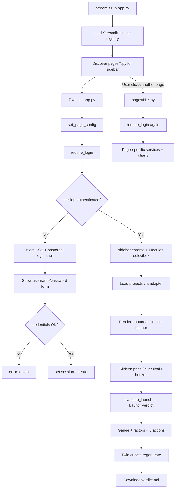
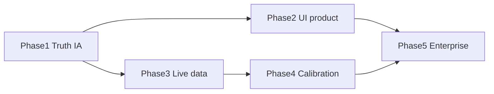

# PROJECT_MASTER_REVIEW.md

**Product:** AURA-Market — Launch Decision Co-pilot + Bagaluru Real Estate DSS  
**Repository:** `C:\Users\Admin\Projects\bagaluru-analytics-dss`  
**Remote:** https://github.com/Tevskrishna/aura-market-dss  
**Live demo:** https://aura-market-dss.streamlit.app  
**Review type:** Read-only inspection — **no source code modified**  
**Review date:** 2026-07-20  
**Audience:** Senior engineer / product / mentor continuation without tribal knowledge  

> This document supersedes stale notes in `REPOSITORY_STRUCTURE.md` / optimistic “100% complete” framing in parts of `PROJECT_AUDIT.md` for **enterprise** judgment. Submission-demo readiness and production/operator readiness are scored separately.

---

# SECTION 1 — What exactly is this software?

## Business problem

Developers in North Bengaluru (Bagaluru / Aerospace Highway / KIADB corridor) **launch or reprice without seeing**:

1. Competing RERA / coming-soon / under-construction supply  
2. Land cost / margin viability at that price  
3. Who actually books (channels, age, native vs outstation)  
4. Whether marketing ₹ Cr is converting  
5. What happens to the pipeline if a **cheaper rival launches next door**

The core pain is the **competition blind spot** → slow absorption → unsold inventory treated as a Six Sigma “defect.”

## What the software claims to do

A multipage **Decision Support System (DSS)** that combines:

- Diagnostic analytics (DMAIC / sigma / SPC)  
- Competition + margin intelligence  
- Map suitability (25 zones)  
- Digital twin with rival cannibalization  
- **Launch Decision Co-pilot** (product home): **GO / HOLD / NO-GO** + Threat Score 0–100  

## Who are the users?

| Persona | Intent |
|---|---|
| Developer / sales leadership (target buyer) | “Can I launch at ₹X this month?” |
| Mentors / company reviewers | Walkthrough of DMAIC + Map + Twin narrative |
| Demo accounts | `admin` / `admin123`, `demo` / `demo123` |
| Not yet users | Ops teams needing SSO, live KRERA, multi-project enterprise tenancy |

## Industry

**Indian residential real estate / proptech analytics** — micro-market decision support, not a consumer listing portal (not MagicBricks UX) and not a national comps network (not CoStar/PropStack depth).

## Why would someone pay?

**They would pay IF** this reliably answers launch price risk with **live** competition + inventory and produces rupee-denominated exposure before brochure print.

**They would not pay today** for seed CSVs + demo auth + illustrative ML framed as operator software.

**Honest value today:** submission / mentor demo + **product concept** (Launch Co-pilot) that is differentiated from a plain dashboard.

---

# SECTION 2 — Repository Overview

## Repository tree (runtime-relevant)

```
bagaluru-analytics-dss/
├── app.py                          # Launch Decision Co-pilot (home product)
├── pages/                          # 12 Streamlit war-room modules
├── services/                       # Canonical business logic
├── components/                     # UI chrome, media, viz studio, copilot widgets
├── config/                         # settings, auth, schemas
├── models/                         # dataclasses (not .pkl weights)
├── utils/                          # Plotly chart builders
├── data/                           # CSV catalog
├── assets/                         # CSS + SVG + photoreal JPG heroes + ui_ref frames
├── scripts/                        # ETL / seed / validate CLI
├── tests/                          # pytest
├── docs/                           # architecture, demo, limitations
├── _archive/src/                   # legacy dual path (unused at runtime)
├── .streamlit/config.toml          # dark Streamlit theme
├── requirements.txt
├── PROJECT_AUDIT.md
├── REPOSITORY_STRUCTURE.md         # PARTIALLY STALE vs Launch Co-pilot
├── SCOPE.md / README.md
└── PROJECT_MASTER_REVIEW.md        # this file
```

## Folder responsibilities

| Folder | Why it exists |
|---|---|
| `app.py` | Entry product surface (Co-pilot), not a nav index |
| `pages/` | Streamlit multipage modules (auto-discovered) |
| `services/` | Business logic independent of Streamlit widgets |
| `components/` | Reusable UI (auth, KPIs, filters, media, gauges) |
| `config/` | Single source of thresholds, paths, demo users |
| `models/` | Shared typed structures (`FilterState`, KPIs) |
| `utils/` | Presentation-only Plotly helpers |
| `data/` | Local datasets loaded by adapter/catalog |
| `assets/` | Theme CSS, graphics, reference video frames |
| `scripts/` | Offline builders before demos |
| `tests/` | Regression for services / copilot |
| `_archive/` | Dead legacy `src/` kept for history |
| `docs/` | Human docs for mentors |

## File-by-file (critical / non-obvious)

### Root
| File | Role | Notes |
|---|---|---|
| `app.py` | Launch Co-pilot | Real-time sliders → `evaluate_launch` |
| `README.md` | Product story + run/share | Updated for Co-pilot |
| `PROJECT_AUDIT.md` | Earlier architecture audit | Optimistic completion for submission |
| `REPOSITORY_STRUCTURE.md` | Tree inventory | **Stale** on Home / `src/` |
| `SCOPE.md` | Scope notes | |
| `requirements.txt` | Runtime deps | streamlit, pandas, plotly, folium, sklearn, openpyxl |
| `requirements-dev.txt` | pytest | |

### Unused / duplicate / debt
| Item | Status |
|---|---|
| `_archive/src/*` | **Unused at runtime** — duplicate of older services |
| `data/smc_spends.csv` | Loaded; **underused** vs long `marketing_spends.csv` |
| `assets/ui_ref/*.jpg` | Visual reference only — not shown in app |
| `assets/graphics/*.svg` | Used in viz_studio pages, not always on Co-pilot |
| Parallel “Home module cards” | Removed from `app.py` (was old UX) |
| Docs claiming “100%” enterprise | Conflict with production truth |

---

# SECTION 3 — Application Architecture

```
┌──────────────────────────────────────────────────────────┐
│  FRONTEND (Streamlit multipage + custom HTML/CSS/SVG)     │
│  app.py · pages/* · components/* · assets/*.css          │
└────────────────────────────┬─────────────────────────────┘
                             │ calls
┌────────────────────────────▼─────────────────────────────┐
│  BUSINESS LAYER (services/*)                              │
│  launch_copilot · market · competition · twin · map …    │
└────────────────────────────┬─────────────────────────────┘
                             │
┌────────────────────────────▼─────────────────────────────┐
│  DATA LAYER                                               │
│  adapters.get_adapter() → LocalCatalogAdapter             │
│  data_loader.load_catalog() @lru_cache                    │
│  data/*.csv                                               │
└──────────────────────────────────────────────────────────┘
```

| Layer | Implementation |
|---|---|
| **Frontend** | Streamlit widgets + `st.html` CSS injection; Plotly; Folium via `streamlit-folium` |
| **Backend** | No separate API server — Streamlit process *is* the backend |
| **Business** | `services/` pure-ish Python (pandas/numpy) |
| **Data** | CSV + `LocalCatalogAdapter`; `LiveApiAdapter` stub |
| **ML** | sklearn GB (absorption) + RF (zones, circular labels) |
| **Map** | Folium dark_matter + Plotly mapbox dark; point layers |
| **Visualization** | `utils/*charts.py` + `components/viz_studio.py` |
| **Simulation** | `services/twin_service.py` NumPy Poisson DES-style |
| **Configuration** | `config/settings.py`, `.streamlit/config.toml` |
| **Authentication** | Demo plaintext dict → session flags |
| **Reporting** | Markdown + printable HTML downloads |

---

# SECTION 4 — Execution Flow (`streamlit run app.py`)



**Important UX fact:** Multipage sidebar links remain visible even when logged out. Selecting **Competition Intelligence** while logged out shows that URL **but** `require_login()` renders the login hero and `st.stop()` — so the page looks like “Competition” in the nav with a login collage in the main pane. That matches a common reviewer confusion.

---

# SECTION 5 — Navigation

| Mechanism | Behavior |
|---|---|
| **Sidebar** | Streamlit auto multipage links (`app` + `pages/*`). Filename → ugly label (`app`). |
| **Modules selectbox** | `components.layout.render_module_nav` + `st.switch_page` (mobile workaround) |
| **Routing** | File-based Streamlit pages; no FastAPI router |
| **Session state** | Auth flags; Co-pilot / viz_studio nonces; filter widget keys |
| **Caching** | `load_catalog` `@lru_cache(maxsize=1)`; `scored_zones` `@lru_cache`; not `st.cache_data` |
| **Shared components** | `require_login`, `page_hero`, `decision_action`, `viz_studio`, filters |

**initial_sidebar_state** on Co-pilot home is `collapsed` (product focus); other pages often `expanded` by default from Streamlit.

---

# SECTION 6 — Every Page

| Page | Purpose | Inputs | Outputs / KPIs | Charts / tables | Business value | Deps | Done % |
|---|---|---|---|---|---|---|---:|
| **app.py Co-pilot** | GO/HOLD/NO-GO launch verdict | Project, ₹/sqft, cut %, subvention, rival month, horizon | Threat Score, loss/recovery ₹ Cr, 3 actions | Gauge, twin curves | **Core product** | `launch_copilot_service`, twin | **90** |
| **1 Market Overview** | Sigma micro-market scorecard | Global filters | Units, sigma, DPMO, at-risk | Bands, bubble, bookings | DEFINE/MEASURE | market, sigma | **90** |
| **2 Competition** | Blind-spot 4 layers + margin | Planned price | Counts, threats, viability | Bars/scatter + tables | Mentor ask | competition, margin | **85** (seed) |
| **3 Buyer** | Audience mix | Filters | Bookings, channels, age… | Pies/bars | Demand truth | buyer_service | **85** |
| **4 Marketing** | SMC → ROI → cut/boost | Filters | Spend, ROI quartiles | Line/bar/ROI table | Stop blind spend | marketing_service | **80** |
| **5 DMAIC** | DEFINE/MEASURE shell | Filters | CTQs, Pareto, at-risk | Pareto | Method framing | dmaic | **70** (no ANALYZE) |
| **6 Builder Deep Dive** | Per-builder ML + causes | Developer select | Absorption, delay, R² | Stack, ML vs actual | Root cause | recommendation_engine | **88** |
| **7 Digital Twin** | Rival intervention lab | Rates, cut, rival | ₹ Cr paths | Twin multi-curve | Prescribe | twin_service | **85** |
| **8 AI Recs** | Rule actions + mini twin | Project row | Recoverable units | Expand lists | IMPROVE list | recommendation_engine | **75** |
| **9 SPC** | CONTROL I-MR | Series scope | OOC events | I/MR + forecast | Monitor | spc_service | **90** |
| **10 Map DSS** | Where to build | Flood, score, what-if | Zone scores | Folium + radars | Location DSS | map_service | **82** (pseudo RF) |
| **11 Reports** | Mentor brief | Filters | MD/HTML download | Preview | Submission pack | report_service | **80** |
| **12 Forecasting** | Short outlook | Horizon | Forecast bands | Line+CI | Near-term only | spc forecast | **75** |

---

# SECTION 7 — Data

| Dataset | Rows | Purpose | Business meaning | Cleaning | Usage |
|---|---:|---|---|---|---|
| `projects.csv` | 19 | Inventory master | Absorption universe | numeric coerce, absorption, sales_value_cr | Core everywhere |
| `monthly_absorption.csv` | 684 | Time series | SPC / forecast | month parse, FY quarter | SPC, Forecasting |
| `buyer_demographics.csv` | 2580 | Bookings extract | Channel/age/origin | Booking stage filter, FY | Buyer, market bookings |
| `marketing_spends.csv` | 1028 | SMC long ₹ Cr | Spend intensity | period, fy_quarter | Marketing ROI |
| `smc_spends.csv` | 10 | Wide share matrix | Budget concentration | optional melt | Underused |
| `zones.csv` | 25 | Bengaluru zones | Suitability DSS | as-is + engineered feats | Map, Co-pilot tip |
| `rera_projects.csv` | 12 | **Seed** approvals | Crowding | as-is | Competition |
| `upcoming_projects.csv` | 5 | **Seed** pipeline | Rival price pressure | as-is | Competition, Co-pilot |
| `under_construction.csv` | 11 | **Seed** UC | Competing stock | sum unsold | Competition, score |
| `land_prices.csv` | 8 | Land cost | Margin input | as-is | Margin index |
| `lead_insights.csv` | 7 | Curated funnel | Lead PDF gap fill | curated | Buyer page optional |

**Relationships (logical, not FK DB):**  
`projects.project` ≈ fuzzy match to bookings `source_project` and marketing `project`. Competition tables are **not hard-linked** by IDs to inventory.

**Missing / weak fields:** household income sparse; family size inferred; no live listing IDs.

---

# SECTION 8 — Machine Learning

## Model A — Gradient Boosting Absorption
| Item | Detail |
|---|---|
| Location | `services/recommendation_engine.fit_gb_forecast` |
| Algo | `GradientBoostingRegressor` |
| Features | price, size, delay, progress, brand_score, total_units |
| Target | `absorption_pct` |
| Training | 10× Gaussian augmentation then train/test split; **fit on every page load** |
| Status | Demo-ready illustrative |
| Accuracy | Holdout R² shown in UI only — **not gated in CI** |
| Missing | Persisted model, calibration, leakage review, larger n |

## Model B — Random Forest Zone Suitability
| Item | Detail |
|---|---|
| Location | `services/map_service.scored_zones` |
| Algo | `RandomForestRegressor(n_estimators=160)` |
| Labels | **Pseudo-labels from same weighted formula** (circular) |
| Status | Illustrative DSS |
| Accuracy | No external ground truth |
| Missing | True labels (sales velocity by micro-market), spatial CV |

## Non-ML often mistaken for ML
Rule `defect_probability`, recommendation thresholds, SPC `polyfit`+sine forecast, Twin Poisson sim.

---

# SECTION 9 — Digital Twin

| Item | Detail |
|---|---|
| Engine | NumPy loop + Poisson (`twin_service._simulate_path`) — **not SimPy package** |
| Inputs | base monthly rate, months, price, construction %, intervene month/cut/subvention, rival month/price |
| Outputs | baseline / cannibalized / intervention cumulative sold + ₹ Cr |
| Assumptions | Fixed buyer mix weights; rivalry only if cheaper; divert fractions from settings; seasonal sine; linear construction catch-up |
| Limitations | Not survey-calibrated; no inventory capacity hard stop beyond sold count; seed-fixed RNG makes demo stable but not stochastic portfolio risk |

---

# SECTION 10 — Business Logic (every major calc)

| Metric | Formula / rule |
|---|---|
| Absorption % | `units_sold / total_units * 100` |
| At-risk | absorption `< 70` |
| Healthy / sold-out | absorption `≥ 95` |
| DPMO | `(unsold / launched) * 1e6` |
| Sigma | DPMO log-interpolated vs discrete Six Sigma table |
| Defect probability | Additive heuristics (price>9500, delay>6, size>2000, progress<50, brand<7, abs<70) capped 0.95 |
| Recommendations | Rule actions + recoverable unit estimates vs sold-out benches |
| Margin % | `(sale − land*FSI_load − construction_cost) / sale`; Viable≥22%, Stressed≥12%, else Unviable |
| Launch price threat | Upcoming within ~5% → High; ~15% → Medium |
| Suitability | RF on pseudo y / what-if weighted amenities |
| Twin cannibal | Divert budget/normal demand if rival cheaper |
| Native audience | City token match Karnataka/Bengaluru list |
| Age bands | Parsed from applicant age |
| FY quarter | Indian FY Apr start |
| SPC σ | `MR̄/d2`, d2=1.128; UCL/LCL ±3σ; runs rules 8 same-side / 6 trend |
| Forecast | Linear trend + light seasonal sine + residual bands |
| **Launch Threat Score** | Weighted sum: High rivals + Medium + UC pressure + twin ₹ loss + margin stress + absorption health → 0–100 → GO/HOLD/NO-GO |

---

# SECTION 11 — Maps

| Element | Implementation |
|---|---|
| Library | Folium + streamlit-folium; Plotly `scatter_mapbox` |
| Basemap | `CartoDB dark_matter` / `carto-darkmatter` |
| Markers | CircleMarker by suitability traffic light |
| Metro | 13 hardcoded stations overlay |
| Heat / bubble | Plotly size=pop growth, color=score |
| GIS depth | **Points only** — no parcels, shapefiles, topology, drive-time isochrones |
| Future GIS | Needs PostGIS / Mapbox GL / true cadastral layers |

---

# SECTION 12 — UI / UX REVIEW (Senior Product Designer)

## Context of reviewer screenshots
Early versions: empty charcoal login → correctly rejected as non-proptech.  
Photoreal heroes added; still **Streamlit chrome + multipage list labeled `app`**.  
Login collage can appear on other routes when session is logged out (see §4).

| Criterion | Score /10 | Notes |
|---|---:|---|
| Visual hierarchy | 5 | Co-pilot better; secondary pages still stacked widgets |
| Spacing | 5 | Inconsistent density vs enterprise products |
| Typography | 6 | Inter via CSS; limited type scale |
| Navigation | 4 | Ugly `app` label; Modules dropdown patch; 12 peers compete |
| Responsiveness | 4 | CSS media queries exist; Streamlit columns/sidebar remain brittle on phones |
| Accessibility | 3 | Color-only signals; limited ARIA beyond HTML fragments |
| Animations | 5 | SVG pulse / CSS fade; not product-grade motion system |
| Consistency | 5 | Copilot vs older pages diverge |
| Enterprise appearance | 4 | Not JLL/CBRE portal grade |
| Modern appearance | 5 | Dark + photos help; still recognizable Streamlit |
| Dashboard readability | 6 | OK for demos |
| Dark mode | 7 | Intentional charcoal theme |
| Mobile | 3 | Usable with Modules dropdown; not app-like |
| Tablet | 4 | |
| Desktop | 6 | Best of three |

**UI Score: 4.5/10** (honest vs CoStar/PropStack; improved vs blank terminal)  
**UX Score: 5/10**

---

# SECTION 13 — MOBILE REVIEW

| Target | Feasible? | Limitation |
|---|---|---|
| Responsive web in browser | Partial | Sidebar/hamburger + widget stacking |
| PWA | Possible wrappers | Still Streamlit runtime; offline weak |
| Android native | Not this codebase | Needs React Native / Flutter rewrite |
| iPhone native | Not this codebase | Same |
| Tablet | Better than phone | Still not app-shell navigation |
| Desktop | Best | Streamlit desktop ok |

**Cannot become a true native mobile app without a frontend rewrite.**

---

# SECTION 14 — BUSINESS REVIEW (as Puravankara CEO)

**Would I buy this tomorrow?** **No.**

**Why not**
1. Competition / land / upcoming are **seed**, not my live market.  
2. Map RF is **self-labeled**.  
3. Auth is demo passwords in source.  
4. UI still reads “student Streamlit multipage,” not enterprise system of record.  
5. Overlaps my Excel + CRM + agency reports without replacing them.

**What would make me buy / pilot**
1. Live KRERA + listing scrape / partner feed within my catchment.  
2. One Co-pilot screen wired to **my** projects’ actual sales + ad spend.  
3. Enterprise SSO + environment isolation.  
4. Design system that looks like an operator war-room, not 12 sidebars.

---

# SECTION 15 — REAL ESTATE REVIEW (what it looks like)

| Comparator | Similarity |
|---|---|
| Power BI | Medium — KPI cards + dark theme |
| Tableau | Low–medium — less polish, fewer viz types |
| ArcGIS | **Low** — points only |
| JLL / CBRE portals | **Low** — research narrative vs this |
| PropStack | **Low** — no live comps graph |
| CoStar | **Very low** |
| College DMAIC DSS project | **High** — strongest honest classification |
| Differentiator | Launch Co-pilot GO/HOLD idea is **startup-adjacent** if data becomes live |

---

# SECTION 16 — TECHNICAL DEBT (do not fix here)

| Debt | Evidence |
|---|---|
| Duplicate logic | `_archive/src` ≈ old services |
| Dead code | Archive package; ui_ref unused at runtime |
| Bad naming | Sidebar page `app`; typos in booking columns (`Appicant`) |
| Tight coupling | Pages often orchestrate many services directly |
| Hardcoded | Demo passwords; metro stations; divert %; margin costs |
| Performance | GB/RF train on interaction; base64 heroes inflate HTML |
| Memory | Full catalog in process memory fine at current n |
| Security | Plaintext passwords, no rate limit, public Streamlit demo |
| Stale docs | `REPOSITORY_STRUCTURE.md`, parts of audit “100%” |
| Dual marketing truths | `marketing_spends` vs `smc_spends` |
| Login UX trap | Logged-out deep links show login collage under page URL |

---

# SECTION 17 — PROJECT COMPLETION TABLE

| Feature | Status | % | Risk | Priority |
|---|---|---:|---|---|
| Launch Co-pilot | Implemented | 90 | Score weights unvalidated | P0 |
| Multipage DSS modules | Implemented | 85 | Too many surfaces | P1 |
| Service architecture | Implemented | 80 | Coupling drift | P1 |
| Real Excel bookings/SMC ingest | Partial | 70 | Join fuzzy | P0 |
| Seed competition layers | Demo only | 60 | Mentors may reject | P0 |
| Live KRERA/land | Stub | 15 | Blocks paid product | P0 |
| Map DSS | Implemented | 82 | Pseudo RF | P1 |
| Twin | Implemented | 85 | Uncalibrated | P1 |
| Dark UI + photos | Partial | 55 | Still Streamlit look | P0 |
| Mobile excellence | Weak | 35 | Rejection risk | P0 |
| Enterprise auth | Demo | 20 | Security | P0 |
| Tests | Thin | 40 | Regressions | P2 |
| Production deploy hardening | Weak | 30 | Cloud demo OK | P1 |

**Weighted project completion (honest):**  
- Submission / mentor demo package: **~78–85%**  
- Paid operator product: **~35–45%**  
- Investor-grade proptech platform: **~25–35%**

---

# SECTION 18 — WHAT IS MISSING?

## Critical
1. Live competition / land feeds (or honest “simulated market” labeling everywhere)  
2. Product-grade UI (non-Streamlit or radical custom shell) — photos alone are not enough  
3. Single information architecture: **Co-pilot first**, hide wiki of 12 pages behind progressive disclosure  
4. Validated Threat Score with real outcomes  

## Important
5. True suitability labels; remove circular RF claims  
6. SMC autopilot tied weekly to bookings  
7. SSO + audit logs  
8. Mobile PWA/React war-room  

## Nice to have
9. LLM buyer persona chat  
10. PDF branded board pack  
11. Isochrone / parcel GIS  

---

# SECTION 19 — PRODUCT VISION (if this were a startup)

**Name the wedge:** *Launch OS for Indian mid-market developers.*

**IA**
1. **Today** — Co-pilot GO/HOLD (home)  
2. **Threat radar** — rivals on map within X km / ₹ band  
3. **Money lab** — twin + SMC reallocation  
4. **Evidence** — market/buyer/DMAIC collapsed as drill-downs  
5. **Board pack** — one PDF  

**Kill:** 12 peer sidebar destinations as peer equals.

**AI:** Threat Score + recommendations first; GB/RF only behind evidence panels with confidence.

**Pricing:** Per micro-market subscription + SSO seat.

---

# SECTION 20 — UI INSPIRATION (10 products)

| # | Product | Why steal from it |
|---|---|---|
| 1 | **Stripe Dashboard** | Clarity, hierarchy, empty→filled progressive disclosure |
| 2 | **Linear** | Dense but calm; keyboard/nav discipline |
| 3 | **Zillow / Redfin** | Map-first real-estate spatial UX |
| 4 | **CoStar Showcase** | Enterprise real-estate credibility (aspiration) |
| 5 | **Bloomberg Terminal** (select panels) | Decision density without chrome noise |
| 6 | **Datadog** | Live status / alerts language for “threat” |
| 7 | **Notion** | Soft structure for board narrative |
| 8 | **Figma** | Spatial toolbar patterns for Map DSS |
| 9 | **Tesla energy / vehicle app** | One hero metric (like Threat Score) |
| 10 | **Cred / RazorpayX** | Indian fintech trust aesthetic (localization) |

Do **not** inspire from generic AI purple dashboards or cream terracotta brochure sites.

---

# SECTION 21 — MASTER ROADMAP (no code in this review)

### Phase 1 — Truth & positioning (1–2 weeks)
- Label seed data explicitly in UI (“Simulated competition”)  
- Collapse nav to Co-pilot + 4 depth hubs  
- Fix logged-out deep-link UX (redirect home)  
- Dependencies: product decision only  

### Phase 2 — Visual productization (2–4 weeks)
- Custom React/Next shell **or** Streamlit only with radical single-page war-room  
- Design system, real photography, motion  
- Dependencies: Phase 1 IA freeze  

### Phase 3 — Live data (parallel, 3–6 weeks)
- KRERA / partner listings / land feed adapter  
- Replace seeds  
- Dependencies: credentials, legal scrape/API  

### Phase 4 — Scoring calibration (2–3 weeks)
- Backtest Threat Score vs actual absorption outcomes  
- Replace circular RF labels  
- Dependencies: historical sell-through  

### Phase 5 — Enterprise (ongoing)
- SSO, multi-tenant, billing, SLA monitoring  
- Dependencies: paying pilot  



---

# SECTION 22 — FINAL VERDICT

| Dimension | Score /10 | One-line |
|---|---:|---|
| Architecture | **7.5** | Clean services layer; CSV-era adapters |
| UI | **4.5** | Better than blank black; still Streamlit + inconsistent |
| UX | **5.0** | Co-pilot clear; 12-page museum + login deep-link trap |
| ML | **4.0** | Illustrative GB + circular RF |
| Business | **5.5** | Strong problem; weak live proof |
| Scalability | **4.0** | Demo-scale only |
| Maintainability | **7.0** | Services help; docs drift |
| Enterprise readiness | **3.0** | Demo auth, seeds |
| Investor readiness | **4.0** | Concept yes; traction/data no |
| Production readiness | **3.5** | Public demo exists; not SaaS-hardened |
| **Project completion (submission)** | **~80%** | Mentor walkthrough viable with caveats |
| **Project completion (paid product)** | **~40%** | Needs live data + UI rewrite |

---

## Bottom line for a new senior engineer

1. Treat **`app.py` Launch Co-pilot** as the product; treat `pages/*` as evidence drawers.  
2. Treat competition/land/upcoming as **seed** until adapters are live.  
3. Do not market Map RF as validated GIS ML.  
4. Do not trust “100% complete” without specifying **submission vs production**.  
5. Next engineering bet is **not more pages** — it is **live data + product UI shell + calibrated GO/HOLD**.

---

*End of PROJECT_MASTER_REVIEW.md — inspection-only; no application source modified while producing this document.*
