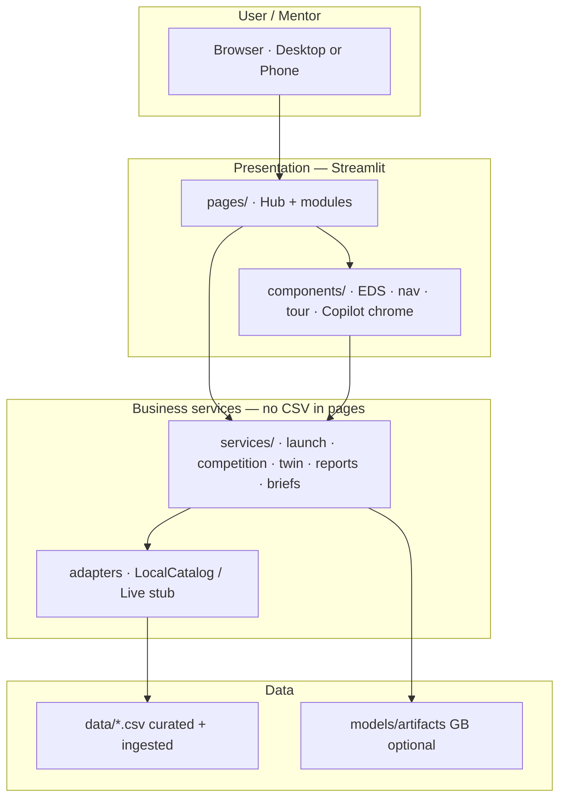
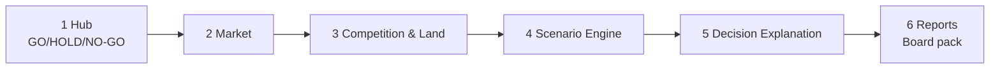
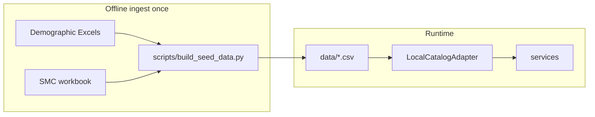

# Mentor Architecture Overview — RealEstateIQ

**Audience:** mentors who need to understand a complex app quickly  
**Companion:** product Q&A in [`../01-qa/MAIN_QA.md`](../01-qa/MAIN_QA.md)

---

## 1. What kind of system is this?

| Type | Meaning |
|------|---------|
| **Decision Support System (DSS)** | Helps leadership decide; does not replace the CEO |
| **Executive Decision OS** | Guided journey around one Hub call |
| **Streamlit multipage web app** | Python UI; deployable on Streamlit Cloud |

**Primary question the architecture optimises for:**

> Should we launch / reprice at this ₹/sqft? → GO / HOLD / NO-GO

---

## 2. Big picture (one diagram)



**Rule of thumb:** Pages render. Services decide/compute. Adapters load data.

---

## 3. Layered folder map

```
bagaluru-analytics-dss/
├── app.py                    # Executive Hub (entry)
├── pages/                    # Streamlit multipage modules
├── components/               # UI chrome only (EDS, nav, tour, Copilot UI, VX)
├── services/                 # Business logic (testable)
├── models/                   # Dataclasses / contracts (not ML weights)
├── repositories/             # Optional data access patterns
├── utils/                    # Chart builders (Plotly helpers)
├── config/                   # Settings, auth, schemas
├── data/                     # Runtime CSVs (source of truth at demo)
├── assets/                   # CSS / graphics
├── tests/                    # pytest
├── docs/                     # Engineering / submission notes
└── mentor/                   # Mentor-facing pack (this folder + Q&A)
```

| Layer | Responsibility | Must not |
|-------|----------------|----------|
| `pages/` | Layout, widgets, call services | Own scoring formulas; read CSVs directly |
| `components/` | Reusable UI (EDS, journey, nav) | Change launch math |
| `services/` | Launch verdict, competition, twin, reports, briefs | Streamlit widgets |
| `adapters` | CSV ↔ frames (live stub ready) | Hide seed vs live without labels |
| `data/` | Validated demo datasets | Be claimed as live KRERA by default |

---

## 4. Decision journey (product architecture)

**IC Demo Mode (default ON)** — short spine for mentors:



**Full Quality Lab** (IC Demo Mode OFF) also exposes Buyer, Marketing, DMAIC, Project Deep Dive, SPC, Map, Forecast — evidence/lab, not alternate Hub verdicts.

### Product rule (critical)

| Surface | Mode | May issue final launch call? |
|---------|------|------------------------------|
| Executive Hub | `final` | **Yes** — only place |
| Market / Competition / Twin / … | `evidence` | No |
| Decision Explanation | `why` | No — explains Hub |
| Reports | `board` | No — reprints Hub Section 0 |

Session bag (`iq_decision_context`) carries project / price / verdict from Hub into Twin, Explanation, Reports (**CEO morning loop**).

---

## 5. Module → service map

| UI module | Main services / engines | Output mentors see |
|-----------|-------------------------|-------------------|
| Executive Hub | `launch_copilot_service`, twin sim, brief adapters | GO/HOLD/NO-GO, threat, ₹ Cr |
| Market Intelligence | `market_service`, sigma KPIs | Absorption / inventory evidence |
| Competition & Land | `competition_service`, `margin_service` | RERA / upcoming / UC / land diligence |
| Scenario Engine | `twin_service` / `simulation_engine` | Directional scenario curves ₹ Cr |
| Decision Explanation | recommendation adapters + Hub context | Why (not a second verdict) |
| Reports | `report_service` | MD / HTML / PDF board pack |
| Buyer / Marketing | demographics / marketing services | Audience & SMC (lab / full nav) |
| DMAIC / SPC / Forecast | dmaic / spc / forecast services | Quality & trust lab |
| Map | `map_service` + Folium | Illustrative zone suitability |

---

## 6. Data architecture



| Concern | Design choice |
|---------|----------------|
| Seed vs measured | Honesty banners + Hub data contract |
| Live future | `LiveApiAdapter` / `AURA_LIVE_*` stubs |
| Cache | Catalog loaders; avoid CSV reads in pages |

**Not in pipeline:** `bengaluru_realestate_dataset.xlsx` (Areas_Data has “Bagaluru” but app does not load it).

---

## 7. Cross-cutting UX architecture (no math change)

| Feature | Where | Role |
|---------|-------|------|
| Executive Decision Sheet (EDS) | `components/executive_sheet.py` | 10-second CEO sheet + Continue |
| IC Demo Mode | `nav_config` + `touch_nav` | Short mentor spine |
| Board Mode | sidebar | Presentation density |
| Visual Experience Mode | `visual_experience.py` | Optional 3D/motion **presentation only** |
| Copilot | `ai_copilot` + `copilot_guide_service` | Page guide, not second verdict |
| Product tour | `product_tour.py` | First-run orientation |

---

## 8. DMAIC mapping (academic view)

| DMAIC | Where it shows up |
|-------|-------------------|
| DEFINE | Hub question + DMAIC workspace CTQs |
| MEASURE | Market, Buyer, Marketing, Competition |
| ANALYZE | Deep Dive, Pareto, Map importance |
| IMPROVE | Explanation actions, Scenario Engine, Forecast |
| CONTROL | SPC + Executive Reports |

For **industry demos**, lead with Hub → Competition → Scenario → Reports; treat deep DMAIC as Quality Lab.

---

## 9. Security & deployment (honest)

| Topic | Current state |
|-------|----------------|
| Auth | Demo users (`admin` / `demo`) via env-overridable passwords |
| Tenancy | Single demo catalog |
| Deploy | Streamlit Cloud from GitHub `master` |
| Secrets | No production IdP / SSO in this phase |

---

## 10. How to read the code in 15 minutes

1. `app.py` — Hub decision loop  
2. `services/launch_copilot_service.py` — verdict shape  
3. `services/decision_brief_service.py` — journey + EDS adapters  
4. `components/executive_sheet.py` — Continue chrome  
5. `services/adapters.py` — data boundary  
6. `pages/2_Competition_Intelligence.py` + `pages/7_Digital_Twin.py` — evidence + scenarios  
7. `pages/11_Executive_Reports.py` + `services/report_service.py` — board close  

---

## 11. Architecture principles (what we protected)

1. **One final recommendation** — Hub only  
2. **Services own math** — late polish was UX-only  
3. **Adapters own I/O** — pages don’t open CSV paths  
4. **Honesty over hype** — seed / simulated labelled  
5. **Optional visuals** — Visual Experience never changes scores  

---

## 12. Related technical docs in repo

| Path | Use |
|------|-----|
| `docs/ARCHITECTURE.md` | Short layer note |
| `docs/AURA_SPEC.md` | Spec mapping |
| `docs/KNOWN_LIMITATIONS.md` | Gaps |
| `REPOSITORY_STRUCTURE.md` | File-by-file map |
| `ENTERPRISE_REVIEW.md` | Enterprise vs demo scores |

---

## Mentor takeaway

The app looks complex because it covers **decision + evidence + simulation + quality lab + reporting**.  
Architecturally it stays simple: **UI → services → adapters → CSV**, with a **single Hub verdict** and a **guided Continue spine** so mentors are not lost in twelve peer dashboards.
